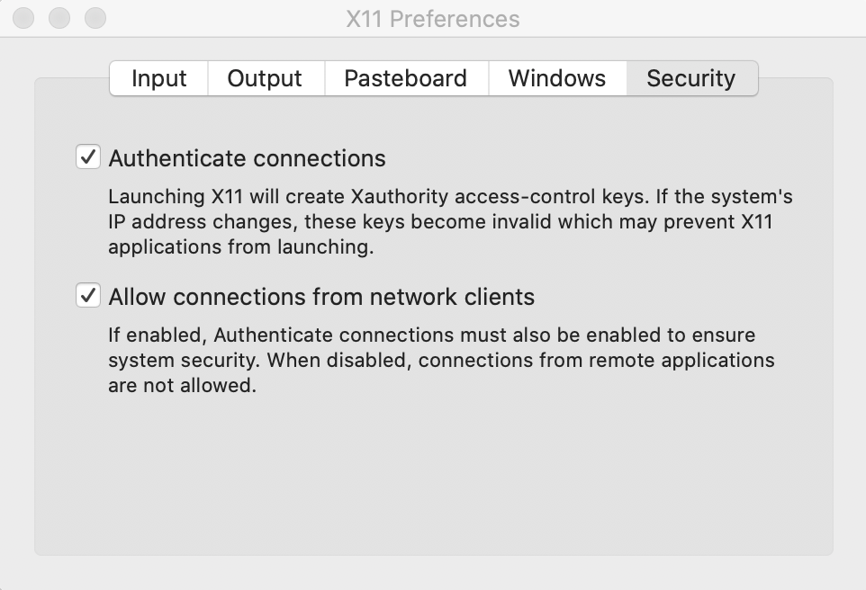
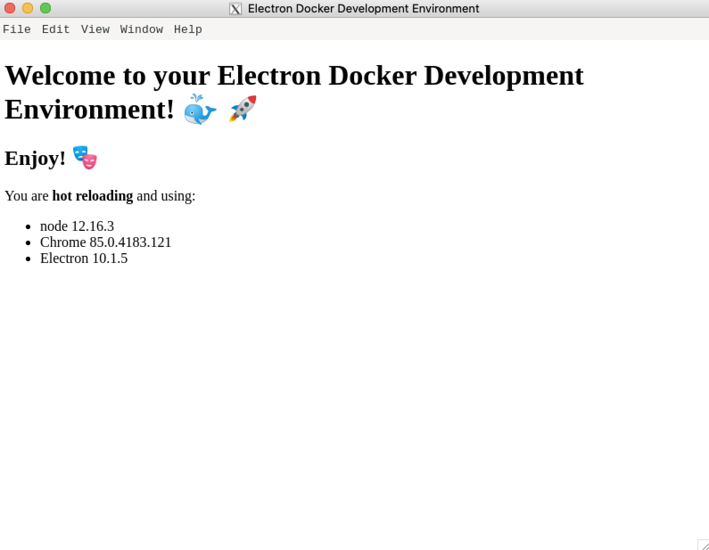

<p  align="center">


<a  href="https://www.twitter.com/pedrorenan/">

</a>
<a  href="https://github.com/tgmarinho/README-ecoleta/commits/master">

</a>

<a  href="https://github.com/pedrorenan/electron-docker-dev-env/stargazers">

</a>
</p>
<!--ts-->

*  [🇧🇷🇵🇹 Português](#-português)

*  [🌎 English](#-english)

<!--te-->

# 🇧🇷🇵🇹 Português

<h3  align="center">

Modelo para Ambiente de Desenvolvimento Electron com Docker.

</h3>


Tabela de conteúdos

=================

<!--ts-->

*  [Sobre o projeto](#-sobre-o-projeto)

*  [Funcionalidades](#-funcionalidades)

*  [Como executar o projeto](#-como-executar-o-projeto)

*  [Pré-requisitos](#pré-requisitos)

*  [Como contribuir no projeto](#-como-contribuir-no-projeto)

*  [Autor](#-autor)

*  [Licença](#-licença)

<!--te-->
  

## 💻 Sobre o projeto


A motivação desse projeto é conseguir desenvolver usando Electron independente o sistema operacional. [Você pode ler mais sobre essa motivação aqui](https://medium.com/@pedrorenan/em-busca-da-independ%C3%AAncia-para-o-ambiente-de-desenvolvimento-2adc22f6f250).

  
---


## ⚙️ Funcionalidades

  
Gera um ambiente de desenvolvimento Electron com Docker que permite empacotar e exportar o aplicativo.

---


## 🚀 Como executar o projeto

  
  
### Pré-requisitos

 
* [Docker](https://www.docker.com/get-started)
* [VSCode](https://code.visualstudio.com/download) 
* Extensão [Remote-Containers](https://marketplace.visualstudio.com/items?itemName=ms-vscode-remote.remote-containers)

#### macOS

* [Homebrew](https://brew.sh/)
* XQuartz
```bash
# Instale o XQuartz
$ brew cask install xquartz
```

abra o XQuartz, navegue até *Preferences -> Security* e deixe as duas opções marcadas.

<p  align="center">



</p>

---

Instruções:

  
É recomendável que você clique em *Use this template*, dessa maneira você já poderá criar o repositório com o nome do seu projeto e iniciar o desenvolvimento.


#### macOS 


```bash
# Obtenha seu ip
$ ip=$(ifconfig en0 | grep inet | awk '$1=="inet" {print $2}')

# Adicione esse ip na lista dos permitidos para conectar no servidor X
$ xhost + ip

# Acesse a pasta do projeto no terminal/cmd
$ cd [your-repository-name]

# Descomente a linha remoteEnv 
$ sed 's+//\"remoteEnv+\"remoteEnv+g' .devcontainer/devcontainer.json

# Substitua HOST_IP pelo ip obtido
$ sed -i '' -e 's+HOST_IP+'$ip'+g' .devcontainer/devcontainer.json

```


#### Todos os SOs


```bash
# Abra o projeto com o VSCode
$ code .
```


Quando o [VSCode](https://code.visualstudio.com/download) abrir você verá uma mensagem informando que foram detectadas as configurações necessárias para que a extensão [Remote-Containers](https://marketplace.visualstudio.com/items?itemName=ms-vscode-remote.remote-containers) faça a mágica acontecer.


<p  align="center">


</p>

  

Clique em "Reopen in Container". O [VSCode](https://code.visualstudio.com/download) vai reiniciar e é só aguardar o ambiente ficar pronto para você. Pode demorar um pouco na primeira vez se você nunca tiver feito o download dos containers necessários 🕐. Mas vale a pena!
  

Quando finalizar, você terá um terminal dentro do [VSCode](https://code.visualstudio.com/download) que já está dentro do container. Tudo integrado! Tipo [Inception](https://www.imdb.com/title/tt1375666/) mesmo 🍿.

  

💡 Tudo que você executar nesse terminal será executado dentro do container apenas!

  

```bash
# Inicie o projeto
$ npm start
```


<p  align="center">



</p>


>🚀 Tente Editar o arquivo index.html para ver o *hot reloading* em ação.

Para empacotar e exportar o aplicativo:


#### macOS 


```bash
# Empacotar e exportar o aplicativo
$ npm run make
```

#### Todos os SOs 


```bash
# Empacotar e exportar o aplicativo
$ npm run make-macos
```

>✅ Os arquivos exportados serão gerados pasta *out/make/[formato]*

  
  

## 💪 Como contribuir no projeto

1. Faça um **fork** do projeto.

2. Crie uma nova branch com as suas alterações: `git checkout -b my-feature`

3. Salve as alterações e crie uma mensagem de commit contando o que você fez: `git commit -m "feature: My new feature"`

4. Envie as suas alterações: `git push origin my-feature`

> Caso tenha alguma dúvida confira este [guia de como contribuir no GitHub](./CONTRIBUTING.md)

---

## 🦸 Autor 

[](https://twitter.com/pedrorenan) [](https://www.linkedin.com/in/opedrorenan/) [](mailto:pedrorenan@gmail.com)

  
---
  

## 📝 Licença

 
Este projeto esta sobe a licença [MIT](./LICENSE).

Feito com ❤️ por Pedro Renan 👋🏽 [Entre em contato!](https://www.linkedin.com/in/opedrorenan/)


---

# 🌎 English

<h3  align="center">

Electron Docker Development Environment Template

</h3>

  
Table of content

=================

<!--ts-->

*  [About](#-about)

*  [Features](#-features)

*  [How it works](#-how-it-works)

*  [Prerequisites](#prerequisites)

*  [How to contribute](#-how-to-contribute)

*  [Author](#-author)

*  [License](#-license)

<!--te-->

  
  

## 💻 About


---

## ⚙️ Features


---


## 🚀 How it works


### Prerequisites


  
When [VSCode](https://code.visualstudio.com/download)  opens, you will see a message stating that the necessary settings have been detected for the [Remote-Containers](https://marketplace.visualstudio.com/items?itemName=ms-vscode-remote.remote-containers) extension to make the magic happen.

<p  align="center">


</p>
  

Click on “Reopen in Container”. The [VSCode](https://code.visualstudio.com/download)  will restart. Just wait for the environment to get ready for you. It may take a while during the first time, specially if you have never downloaded the necessary containers 🕐. But it's worth it!


Once done, you will have a terminal inside the [VSCode](https://code.visualstudio.com/download)  that is already inside the container. Everything integrated! Like [Inception](https://www.imdb.com/title/tt1375666/)  🍿.

💡 Everything you do in this terminal will be done only inside the container!


  
## 💪 How to contribute
  
1. Fork the project.
2. Create a new branch with your changes: `git checkout -b my-feature`
3. Save your changes and create a commit message telling you what you did: `git commit -m" feature: My new feature "`
4. Submit your changes: `git push origin my-feature`
> If you have any questions check this [guide on how to contribute](./CONTRIBUTING.md)
  
---

 
## 🦸 Author

[](https://twitter.com/pedrorenan) [](https://www.linkedin.com/in/opedrorenan/) [](mailto:pedrorenan@gmail.com)

---

## 📝 License

This project is under the license [MIT](./LICENSE).

Made with ❤️ by Pedro Renan 👋🏽 [Get in Touch!](https://www.linkedin.com/in/opedrorenan/)

---